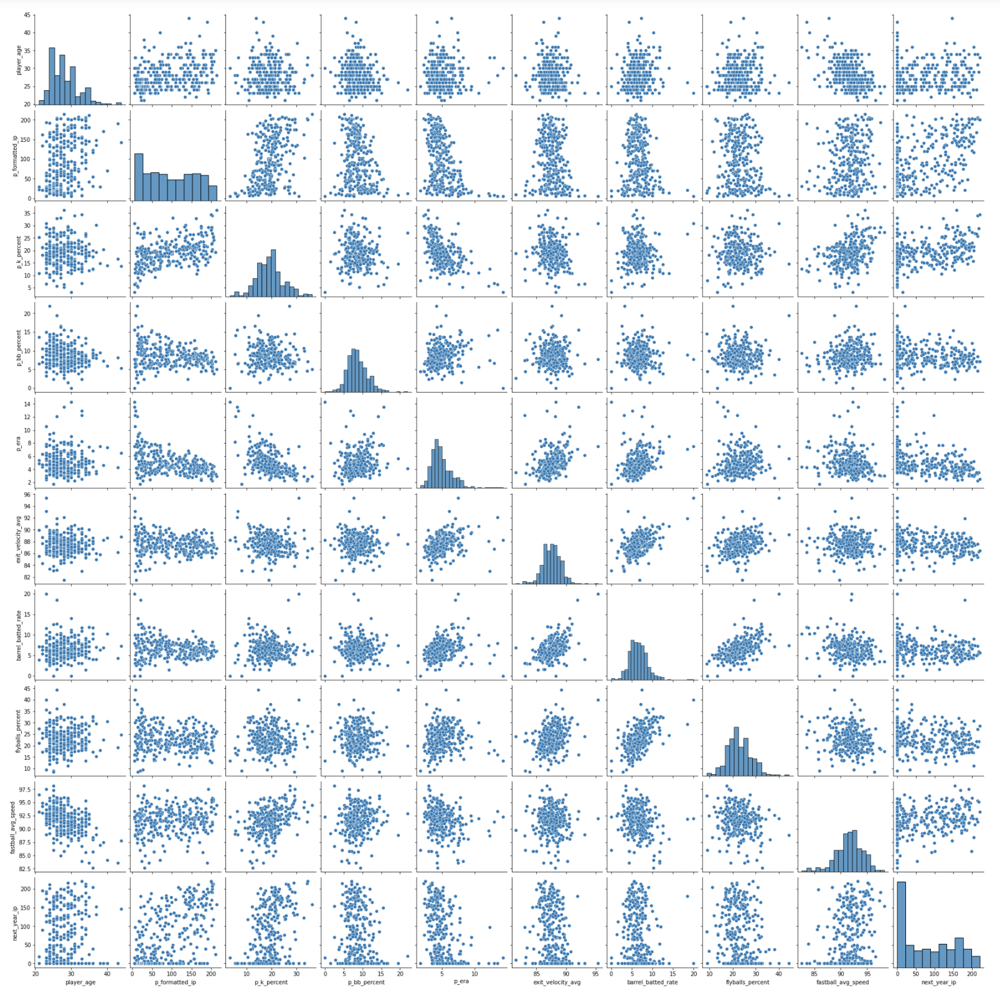

# Informing future innings pitched from previous performance
The goal of this project is to find which which indicators from a baseball pitcher's previous performance will inform how many innings he might throw in the upcoming season.

The above image is a pairplot of the various features used for the initial model.

After scraping statistic data from baseballsavant.mlb.com using Selenium and Beautiful Soup, a pitcher's 2018 innings total used as a target value, while his 2017 statistics were used as features. The features that correlated most strongly with the pitcher's 2018 innings total were Age, Innings Pitched (in 2017), Strikeout %, and Flyball %. The current R-squared value is .70 (low), so further iterations will be necessary to build a better model. 
